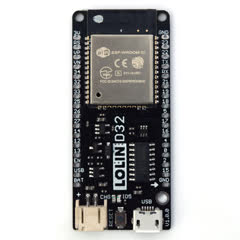
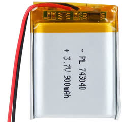
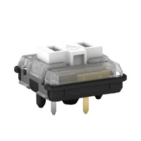
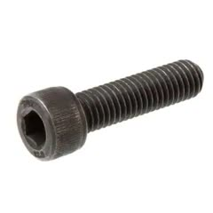
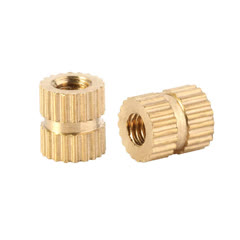
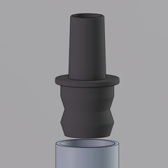
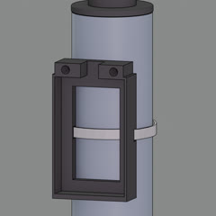
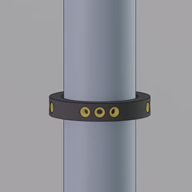
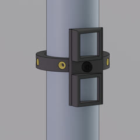
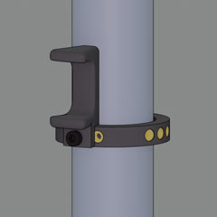

# eTube: An augmented instrument controller

Etu{d,b}e simultaneously refers to the name of the augmented instrument, the eTube, and a series of improvised performances based on human-computer musical interactions, or études. Custom electronics based on the esp32 chip are interfacing the sensors and actuators to relay information between the musician and the computer wirelessly. The instrumentalist’s preferences regarding some inherent qualities of sensors and the topology of the 3D printed controller were at the heart of the design process. The controller is attached to the acoustic instrument without obstructing regular playing technique.

## Hardware

### Electronic parts
  
  | Item                   | PCS | Ref Image                          | Notes                                                       |
  | ---------------------- | --- | ---------------------------------- | ------------------------------------------------------------|
  | ESP32 LOLIN D32        | 1   |           |  Multiple ESP32 boards should work just fine                                                         |  
  | Lipo Battery           | 1   |            |  3.7v and around 900 mAh                                                            |  
  | Choc Switches          | 2   |             |  Also compatible with Cherry MX switches                                                          |  

### Standard parts
  
  | Item                            | PCS  | Ref Image                                   | Notes                                                       |
  | ------------------------------- | ---- | ------------------------------------------- | ------------------------------------------------------------|
  | M3x8mm Screws                   | 2    |    | Used to fix the Thumb Rest and the Switch Holder|
  | M2x8mm Screws                   | 2    |    | Used to fix the ESP32 board|
  | M3x6mm Inserts                  | 9    |   | Are inserted all around the ring |
  | M2x6mm Inserts                  | 2    |   | Goes at the top of the Battery Holder|

### 3D printed parts

| Item                  | PCS | Ref Image                           | Notes            |
| --------------------- | --- | ----------------------------------- | ---------------- |
| Mouth Piece Adapter   | 1   | | This version is made for a baryton saxophone|
| Battery Holder        | 1   | | Still need to be fixed with a zip tie|
| Ring                  | 1   | | Assuming a tube diameter of 31 mm|
| Switch Holder         | 1   | | Compatible with various models of switches|
| Thumb Rest            | 1   | | Mostly for comfort, to the taste of the user|

## Firmware
The controller uses the [lemmingDev / ESP32-BLE-Gamepad](https://github.com/lemmingDev/ESP32-BLE-Gamepad) library.

### Arduino Configuration
The development has been made using platformIO, the code is provided as is and might need some modification to run in your environment.

### Communication protocol
You should be able to connect to the eTube by selecting it in your Bluetooth device list.
The controller is seen as HID so the buttons (with ID 4 and 5) information can be received by any compatible software.

## Acknowledgment
This work is supported by a 2021-2022 Student Award from the Centre for Interdisciplinary Research in Music Media and Technology (CIRMMT).