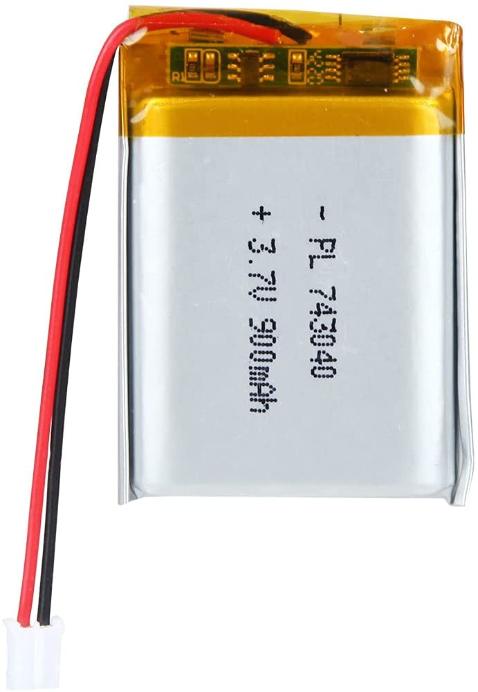
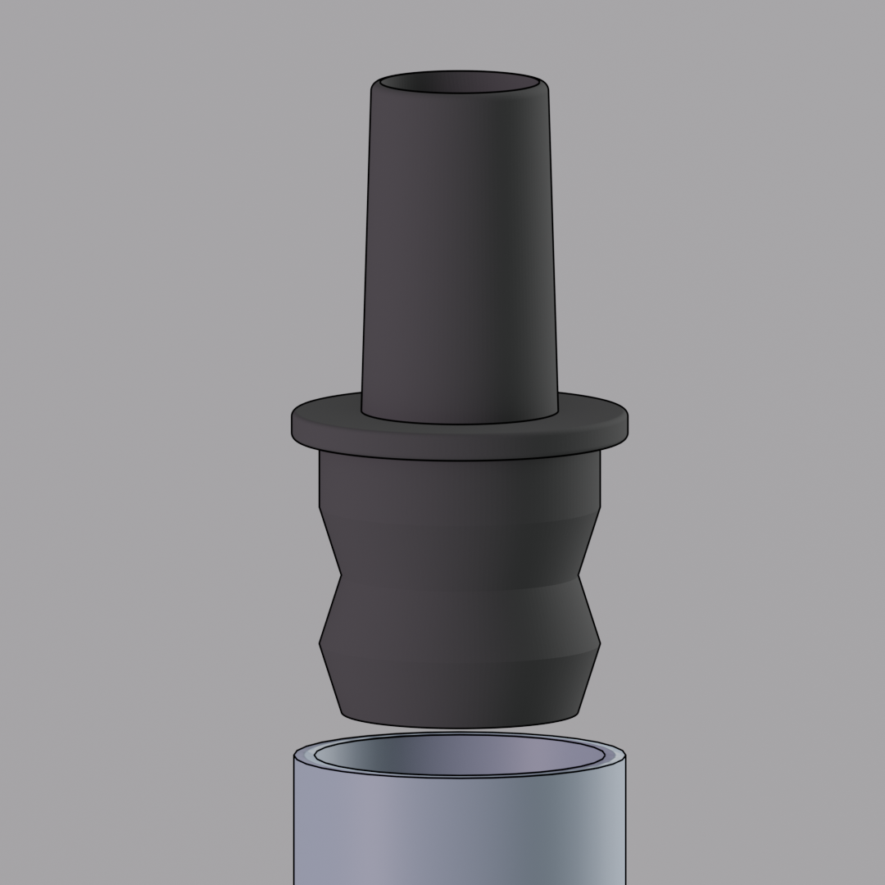
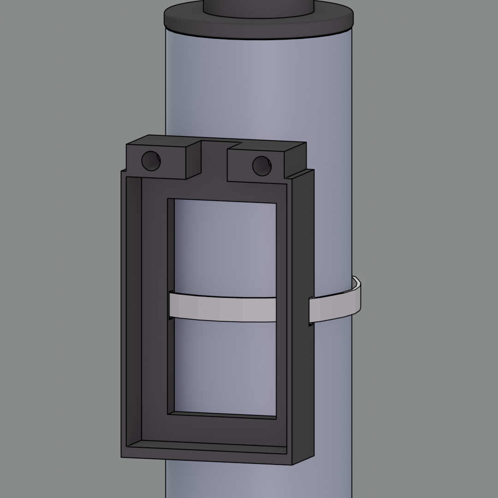
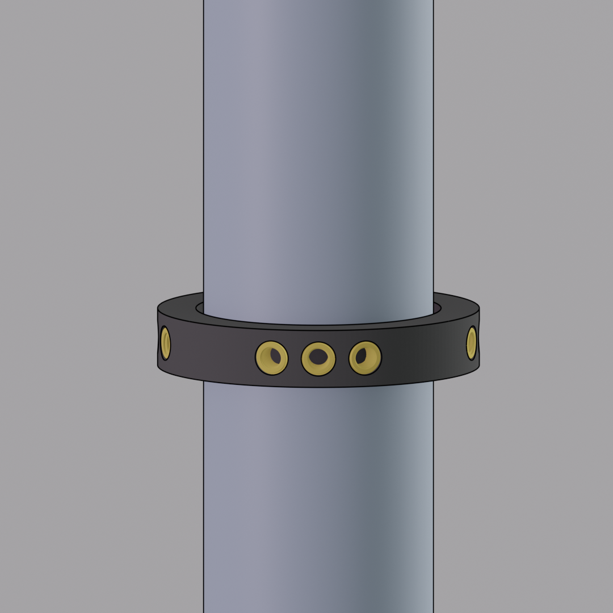
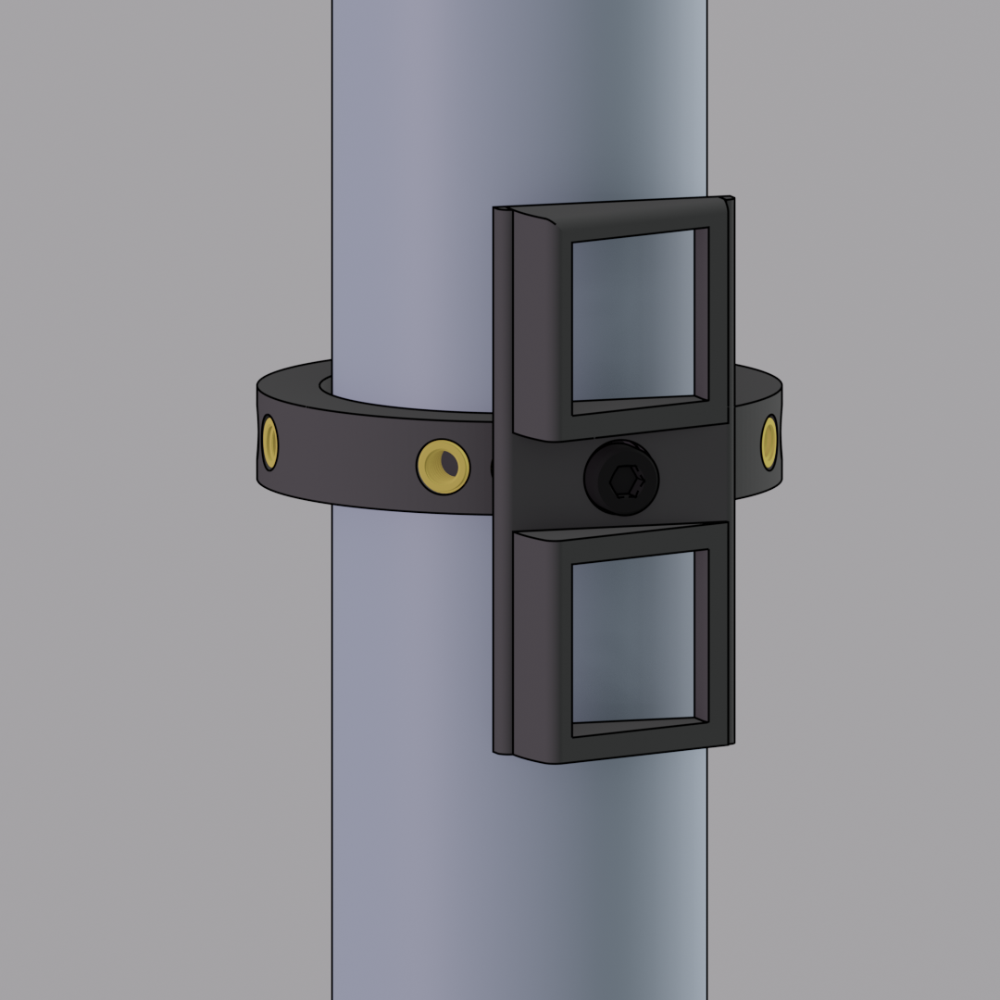

# eTube: An augmented instrument controller

Etu{d,b}e simultaneously refers to the name of the augmented instrument, the eTube, and a series of improvised performances based on human-computer musical interactions, or études. Custom electronics based on the esp32 chip are interfacing the sensors and actuators to relay information between the musician and the computer wirelessly. The instrumentalist’s preferences regarding some inherent qualities of sensors and the topology of the 3D printed controller were at the heart of the design process. The controller is attached to the acoustic instrument without obstructing regular playing technique.

## Hardware

### Electronic parts
  
  | Item                   | PCS | Ref image                          | Notes                                                       |
  | ---------------------- | --- | ---------------------------------- | ------------------------------------------------------------|
  | ESP32 LOLIN D32        | 1   |            |  Multiple ESP32 boards should work just fine                                                         |  
  | Lipo Battery           | 1   |            |  3.7v and around 900mAh                                                            |  
  | Choc Switches          | 2   |             |  Also compatible with Cherry MX switches                                                          |  

### Standard parts
  
  | Item                            | PCS  | Notes                                       |
  | ------------------------------- | ---- | ------------------------------------------- |
  | M3x8mm Screws                   | 2    |  |
  | M2x8mm Screws                   | 2    |  |
  | M2x6mm Inserts                  | 2    |  |
  | M2x6mm Inserts                  | 2    |  |

### 3D printed parts

| Item                  | PCS | Ref image                           | Notes            |
| --------------------- | --- | ----------------------------------- | ---------------- |
| Mouth Piece Adapter   | 1   | ||
| Battery Holder        | 1   | ||
| Ring                  | 1   | ||
| Switch Holder         | 1   | ||
| Thumb Rest            | 1   | ||

## Firmware
The controller uses the [lemmingDev / ESP32-BLE-Gamepad](https://github.com/lemmingDev/ESP32-BLE-Gamepad) library.

### Arduino Configuration
The development have been made using platformIO, the code is provided as is and might need some modification to run in your environement.

### Communication protocol
You should be able to connect to the eTube by selecting it in your Bluetooth device list.
The controller is seen as HID so the buttons (with ID 4 and 5) information can be receive by any compatible software.

## Acknowledgment
This work is supported by a 2021-2022 Student Award from the Centre for Interdisciplinary Research in Music Media and Technology (CIRMMT).