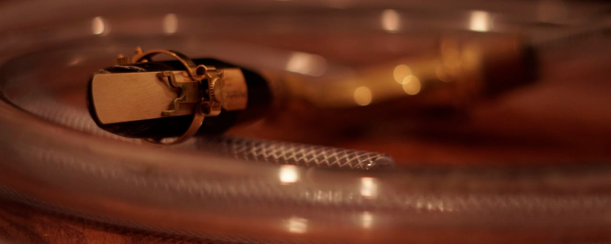

# eTube: augmented instrument controller

Etu{d,b}e simultaneously refers to the name of the augmented instrument, the eTube, and a series of improvised performances based on human-computer musical interactions, or études. Custom electronics based on the esp32 chip are interfacing the sensors and actuators to relay information between the musician and the computer wirelessly. The instrumentalist’s preferences regarding some inherent qualities of sensors and the topology of the 3D printed controller were at the heart of the design process. The controller is attached to the acoustic instrument without obstructing regular playing technique.

## Hardware

### Off-the-shelf parts

- Electronic parts
  
  | Item                   | PCS | Ref image                          | Notes                                                       |
  | ---------------------- | --- | ---------------------------------- | ------------------------------------------------------------|
  | ESP32 LOLIN D32)       | 1   |            |                                                             |  
  | X volt battery         | 1   |            |                                                             |  
  | Choco switches         | 1   |            |                                                             |  

- Standard parts
  
  | Item                            | PCS  | Notes                                       |
  | ------------------------------- | ---- | ------------------------------------------- |
  | M5-0.8x5mm headless screw       | 1    | Seal the input/output of the cylinder.      |
  | M2x15 screws                    | N    | You may need to trim some of those shorter. |

### 3D printed parts 1

| Item                  | PCS  | Ref image                           | Notes                                                        |
| --------------------- | ---- | ----------------------------------- | ------------------------------------------------------------ |
| Mouth Piece Adapter   | 1    |             | mouthPieceAdapterV2.STL                                      |
| Ring                  | 1    |           | ringV6.STL                                                   |
| Switch Holder         | 1    |           | ringV6_Switch.STL                                            |
| Thumb Rest            | 1    |           | ringV6_Thumb.STL                                             |
| Battery Holder        | 1    |           | batteryHolder_D32Holder.STL                                  |

## Firmware

### Arduino Configuration

## Communication protocol

## Acknowledgment

This work is supported by a 2021-2022 Student Award from the Centre for Interdisciplinary Research in Music Media and Technology (CIRMMT).